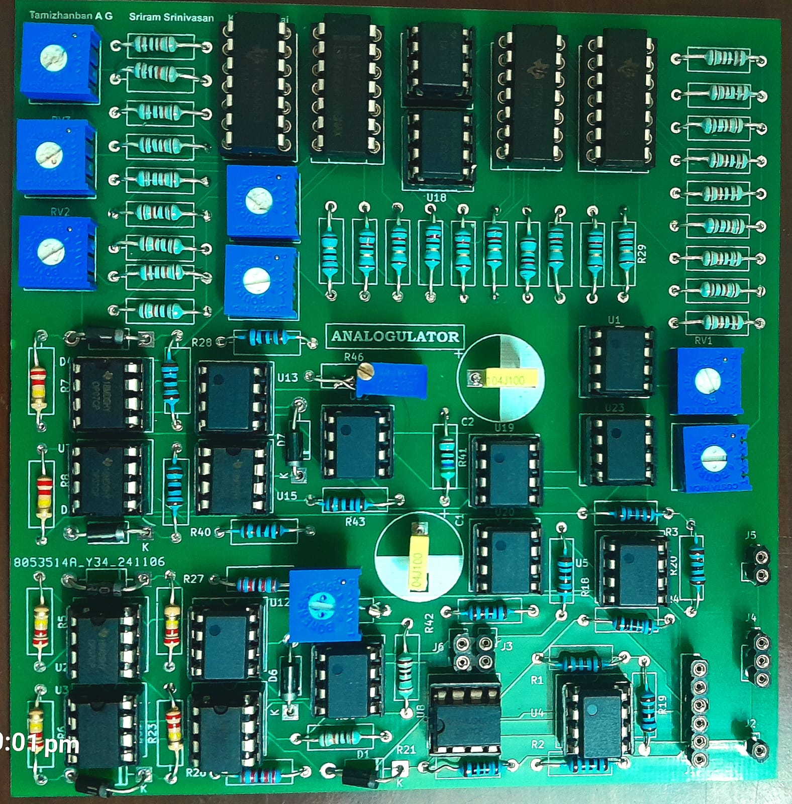
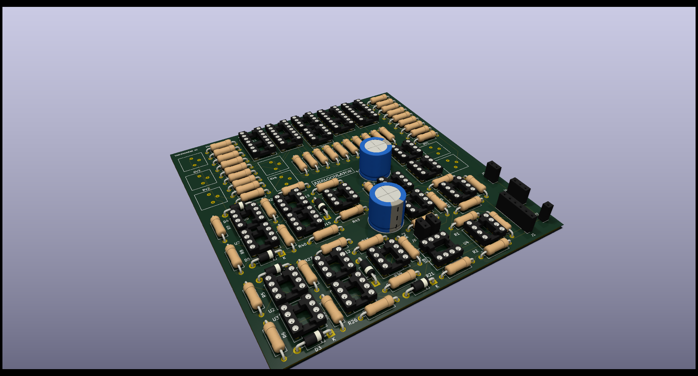

# Analogulator

In an era dominated by digital computation, analog computing remains relevant for specific applications that require real-time processing, low power consumption, and continuous data handling. Unlike digital calculators that rely on discrete logic and binary arithmetic, analog calculators use continuous voltage or current levels to represent data, enabling faster and more efficient computations for certain tasks.

This project, "Analog Calculator," aims to design a calculator using only analog components (e.g., op-amps, MOSFETs, resistors, capacitors) to perform mathematical operations such as addition, subtraction, multiplication, division, and advanced functions like integration and differentiation. By leveraging analog circuits, this project explores a simpler, more efficient approach to computations in specific real-world scenarios.

Hence, we have designed PCB for the analog calculator inside a 11 cm x 11 cm frame and you can see the final product shown below.

